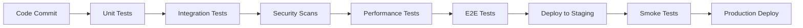

# Portalis NVIDIA Stack Testing Strategy

## Executive Summary

This document outlines the comprehensive testing strategy for the Portalis NVIDIA technology integration stack, covering all 6 major components: NeMo, CUDA, Triton, NIM, DGX Cloud, and Omniverse.

## Testing Objectives

### Primary Goals

1. **Functional Correctness**: Ensure all components work as specified
2. **Performance Validation**: Meet or exceed target performance metrics
3. **Integration Reliability**: Validate seamless integration across stack
4. **Security Assurance**: Prevent vulnerabilities and unauthorized access
5. **Scalability Verification**: Confirm system scales under load
6. **Regression Prevention**: Detect performance and functionality regressions

### Success Criteria

- ✅ 80%+ code coverage across all components
- ✅ All integration tests passing
- ✅ P95 latency < 500ms for translation
- ✅ Throughput > 10 req/s
- ✅ E2E pipeline < 5 minutes
- ✅ Omniverse FPS > 30
- ✅ Zero critical security vulnerabilities
- ✅ CI/CD pipeline < 30 minutes

## Test Pyramid

```
                    /\
                   /  \
                  / E2E \              10% - Slow, Full Stack
                 /______\
                /        \
               /  Integration\         30% - Medium Speed
              /____________  \
             /                \
            /    Unit Tests    \      60% - Fast, Isolated
           /____________________\
```

### Layer Distribution

1. **Unit Tests (60%)**
   - Individual functions and classes
   - Fast execution (< 1s per test)
   - No external dependencies
   - High coverage of edge cases

2. **Integration Tests (30%)**
   - Component interactions
   - Medium execution (1-30s per test)
   - Local service dependencies
   - Cross-component validation

3. **End-to-End Tests (10%)**
   - Complete user workflows
   - Slow execution (30s-5min per test)
   - Full stack dependencies
   - Business-critical scenarios

## Component Testing Strategy

### 1. NeMo Integration

**Scope**: Python to Rust translation using NeMo models

**Test Categories**:
- ✅ Model loading and initialization
- ✅ Translation accuracy and confidence
- ✅ Batch processing efficiency
- ✅ Embedding generation
- ✅ Context-aware translation
- ✅ Error handling and recovery

**Key Metrics**:
- Translation accuracy: > 85% confidence
- Batch throughput: > 50 translations/sec
- Memory usage: < 4GB per model
- Model load time: < 30s

**Test Files**:
- `nemo-integration/tests/test_nemo_service.py`
- `tests/integration/test_nemo_cuda_integration.py`

### 2. CUDA Acceleration

**Scope**: GPU-accelerated processing for translation

**Test Categories**:
- ✅ Kernel correctness
- ✅ Memory management
- ✅ CPU/GPU fallback
- ✅ Multi-GPU support
- ✅ Performance optimization

**Key Metrics**:
- GPU utilization: > 80%
- Speedup vs CPU: > 10x
- Memory leaks: 0
- Kernel execution time: < 1ms

**Test Files**:
- `cuda-acceleration/tests/test_kernels.py`
- `tests/integration/test_nemo_cuda_integration.py`

### 3. Triton Deployment

**Scope**: Model serving infrastructure

**Test Categories**:
- ✅ Model serving correctness
- ✅ Auto-scaling behavior
- ✅ Health checks and monitoring
- ✅ Batch request handling
- ✅ Interactive API

**Key Metrics**:
- Serving latency P95: < 200ms
- Throughput: > 100 req/s
- Model load time: < 60s
- Auto-scale time: < 120s

**Test Files**:
- `deployment/triton/tests/test_triton_integration.py`
- `tests/integration/test_triton_nim_integration.py`

### 4. NIM Microservices

**Scope**: API endpoints and orchestration

**Test Categories**:
- ✅ REST API endpoints
- ✅ gRPC services
- ✅ Authentication/authorization
- ✅ Rate limiting
- ✅ Error handling

**Key Metrics**:
- API latency P95: < 100ms
- Throughput: > 200 req/s
- Rate limit accuracy: 100%
- Auth success rate: 100%

**Test Files**:
- `nim-microservices/tests/test_api.py`
- `nim-microservices/tests/test_grpc.py`
- `tests/integration/test_triton_nim_integration.py`

### 5. DGX Cloud

**Scope**: Distributed workload management

**Test Categories**:
- ✅ Job scheduling and execution
- ✅ Resource allocation
- ✅ Cost tracking and optimization
- ✅ Fault tolerance and recovery
- ✅ Storage management

**Key Metrics**:
- Job submission latency: < 1s
- Scheduling efficiency: > 90%
- Resource utilization: > 85%
- Fault recovery time: < 60s

**Test Files**:
- `dgx-cloud/tests/test_scheduler.py`
- `tests/integration/test_dgx_cloud_integration.py`

### 6. Omniverse Integration

**Scope**: WASM loading and execution

**Test Categories**:
- ✅ WASM module loading
- ✅ USD schema integration
- ✅ Performance validation (FPS)
- ✅ Scene interaction
- ✅ Concurrent module execution

**Key Metrics**:
- WASM load time: < 100ms
- Execution latency: < 1ms
- Frame rate: > 30 FPS
- Memory per module: < 10MB

**Test Files**:
- `omniverse-integration/tests/test_wasm_bridge.py`
- `tests/integration/test_omniverse_wasm_integration.py`

## Integration Test Scenarios

### Scenario 1: NeMo → CUDA → Triton Pipeline

**Flow**:
1. Submit Python code to NeMo
2. Translate to Rust with CUDA acceleration
3. Serve via Triton
4. Validate latency < 500ms

**Test**: `test_nemo_to_triton_pipeline()`

### Scenario 2: NIM → DGX Cloud Deployment

**Flow**:
1. Submit translation job via NIM API
2. Schedule on DGX Cloud
3. Scale from 1 to 10 replicas
4. Validate cost tracking

**Test**: `test_nim_dgx_deployment()`

### Scenario 3: Full Stack Translation

**Flow**:
1. Python code → NeMo translation
2. Rust code → WASM compilation
3. WASM → Omniverse loading
4. Validate end-to-end < 5 minutes

**Test**: `test_full_translation_pipeline()`

### Scenario 4: Omniverse WASM Execution

**Flow**:
1. Translate Python → Rust → WASM
2. Load WASM in Omniverse
3. Execute in scene
4. Validate > 30 FPS

**Test**: `test_omniverse_wasm_execution()`

## Performance Testing

### Benchmark Suite

1. **Latency Distribution**
   - P50, P95, P99 measurements
   - Per-component breakdown
   - Regression detection

2. **Throughput Scaling**
   - Concurrent request handling
   - Load balancing validation
   - Resource utilization

3. **Resource Usage**
   - CPU, GPU, memory profiling
   - Leak detection
   - Optimization validation

4. **Stress Testing**
   - Maximum load capacity
   - Degradation patterns
   - Recovery behavior

### Performance Baselines

| Component | Metric | Baseline | Alert Threshold |
|-----------|--------|----------|-----------------|
| NeMo | Translation P95 | 500ms | 600ms (+20%) |
| CUDA | GPU Speedup | 10x | 8x (-20%) |
| Triton | Serving P95 | 200ms | 240ms (+20%) |
| NIM | API P95 | 100ms | 120ms (+20%) |
| DGX | Job Submit | 1s | 1.2s (+20%) |
| Omniverse | FPS | 60 | 50 (-17%) |

## Security Testing

### Security Test Categories

1. **Authentication/Authorization**
   - Valid/invalid token handling
   - Permission enforcement
   - Session management

2. **Input Validation**
   - SQL injection prevention
   - Code injection prevention
   - Path traversal prevention
   - XSS prevention

3. **Rate Limiting**
   - Request throttling
   - Burst handling
   - DDoS protection

4. **Data Protection**
   - Encryption validation
   - Secure communication
   - Secrets management

5. **Error Handling**
   - No information leakage
   - Consistent error responses
   - Proper logging

### Security Tools

- **Bandit**: Python security linter
- **Safety**: Dependency vulnerability scanner
- **OWASP ZAP**: API security scanner (manual)
- **pytest-security**: Security-focused test framework

## Test Environment Strategy

### Local Development

```yaml
Environment: Developer workstation
Services: Mock services or Docker containers
GPU: Optional (CPU fallback)
Data: Synthetic test data
Purpose: Rapid iteration, debugging
```

### CI/CD Pipeline

```yaml
Environment: GitHub Actions runners
Services: Docker Compose
GPU: Self-hosted runners for GPU tests
Data: Fixtures and generated data
Purpose: Automated validation, regression detection
```

### Staging

```yaml
Environment: Cloud-based staging cluster
Services: Full NVIDIA stack
GPU: DGX nodes
Data: Production-like dataset
Purpose: Pre-production validation
```

### Production

```yaml
Environment: Production DGX Cloud
Services: Production NVIDIA stack
GPU: Full DGX infrastructure
Data: Real production data
Purpose: Smoke tests, monitoring
```

## Test Data Management

### Data Sources

1. **Synthetic Data**: Generated by test fixtures
2. **Sample Datasets**: Curated Python code samples
3. **Production Samples**: Anonymized production data
4. **Edge Cases**: Manually crafted challenging cases

### Data Generation

```python
# Example: Generate test code
@pytest.fixture
def python_code_generator():
    def generate(complexity: str, count: int):
        # Generate Python code based on complexity
        pass
    return generate
```

### Data Privacy

- No PII in test data
- Anonymize production samples
- Secure test credentials
- Clean up test data after runs

## Continuous Integration

### CI/CD Workflow



### Pipeline Stages

1. **Pre-commit**: Linting, formatting
2. **Commit**: Unit tests, fast integration tests
3. **PR**: Full test suite
4. **Merge**: E2E tests, security scans
5. **Nightly**: GPU tests, performance benchmarks
6. **Release**: Full validation, staging deployment

### Quality Gates

| Stage | Required Pass Rate | Max Duration |
|-------|-------------------|--------------|
| Unit Tests | 100% | 10 min |
| Integration | 95% | 20 min |
| E2E | 90% | 30 min |
| Security | 100% | 15 min |
| Performance | Baseline +20% | 30 min |

## Test Maintenance

### Regular Activities

- **Weekly**: Review flaky tests, update baselines
- **Monthly**: Review coverage, identify gaps
- **Quarterly**: Refactor test suite, update strategy
- **Annually**: Major test infrastructure upgrades

### Flaky Test Management

1. **Detection**: Track failure patterns
2. **Isolation**: Reproduce failures locally
3. **Fix**: Address root cause
4. **Quarantine**: Mark as flaky if unfixable
5. **Remove**: Delete if consistently flaky

### Coverage Improvement

1. **Identify gaps**: Use coverage reports
2. **Prioritize**: Focus on critical paths
3. **Add tests**: Write targeted tests
4. **Validate**: Verify coverage increase
5. **Maintain**: Keep coverage above threshold

## Metrics and Reporting

### Key Metrics

1. **Test Health**
   - Pass rate
   - Flaky test count
   - Execution time
   - Coverage percentage

2. **Build Health**
   - Build success rate
   - Average build time
   - Queue time
   - Deployment frequency

3. **Quality Metrics**
   - Bug escape rate
   - Mean time to detection
   - Mean time to resolution
   - Production incident rate

### Dashboards

- **Test Dashboard**: Real-time test results
- **Coverage Dashboard**: Coverage trends
- **Performance Dashboard**: Benchmark history
- **Security Dashboard**: Vulnerability tracking

## Conclusion

This testing strategy ensures comprehensive validation of the Portalis NVIDIA stack through:

- **Multi-layered testing**: Unit, integration, E2E
- **Performance validation**: Benchmarks and regression detection
- **Security assurance**: Automated security testing
- **Continuous improvement**: Regular reviews and updates
- **Clear metrics**: Measurable success criteria

The strategy supports rapid development while maintaining high quality standards and production reliability.

---

**Document Version**: 1.0.0
**Last Updated**: 2025-10-03
**Owner**: QA Engineering Team
**Review Cycle**: Quarterly
