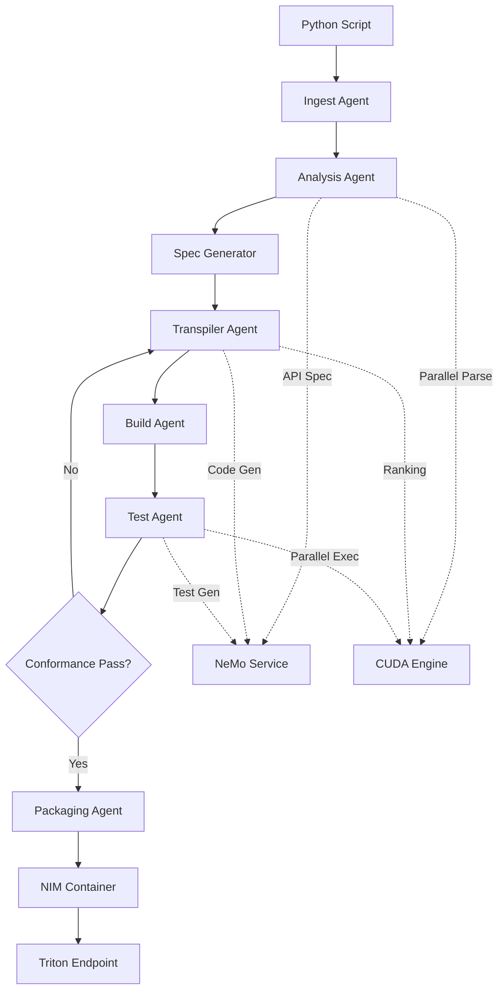
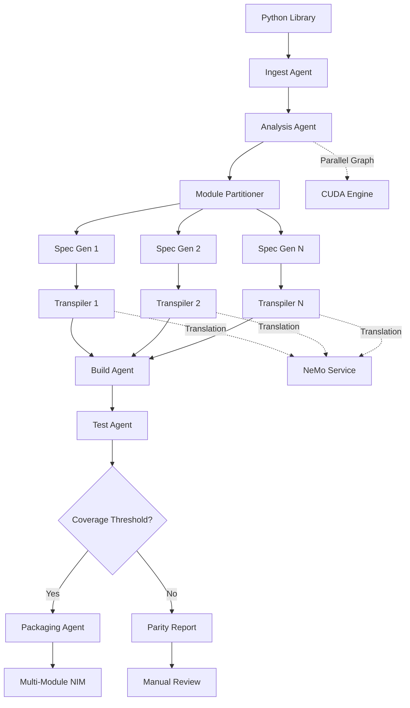

# System Architecture - PORTALIS
## Python → Rust → WASM Platform with NVIDIA Acceleration

---

## 1. EXECUTIVE SUMMARY

This architecture defines a multi-agent, GPU-accelerated system that translates Python codebases (scripts or libraries) into Rust, compiles them to WASM/WASI modules, and packages them as NIM microservices deployable on NVIDIA Triton Inference Server. The design emphasizes:

- **Modularity**: Independent agents with clear contracts
- **Testability**: London School TDD with comprehensive mocking/stubbing
- **Scalability**: GPU-accelerated parallelism via CUDA
- **Enterprise Readiness**: Triton/NIM packaging for production deployment
- **Flexibility**: Support for both script-level and library-level translation

---

## 2. COMPONENT ARCHITECTURE

### 2.1 System Layers

```
┌─────────────────────────────────────────────────────────────────┐
│                      PRESENTATION LAYER                         │
│  CLI Interface │ Web Dashboard │ Omniverse Plugin │ API Gateway │
└─────────────────────────────────────────────────────────────────┘
                              ▼
┌─────────────────────────────────────────────────────────────────┐
│                    ORCHESTRATION LAYER                          │
│    Flow Controller │ Agent Coordinator │ Pipeline Manager       │
└─────────────────────────────────────────────────────────────────┘
                              ▼
┌─────────────────────────────────────────────────────────────────┐
│                      AGENT SWARM LAYER                          │
│  Ingest │ Analysis │ Translation │ Build │ Test │ Package       │
└─────────────────────────────────────────────────────────────────┘
                              ▼
┌─────────────────────────────────────────────────────────────────┐
│                    ACCELERATION LAYER                           │
│  NeMo LLM Services │ CUDA Engines │ Embedding Services          │
└─────────────────────────────────────────────────────────────────┘
                              ▼
┌─────────────────────────────────────────────────────────────────┐
│                   INFRASTRUCTURE LAYER                          │
│  Triton Server │ Storage │ Cache │ Monitoring │ Telemetry       │
└─────────────────────────────────────────────────────────────────┘
```

### 2.2 Core Agents

#### **A. Ingest Agent**
**Responsibility**: Accept Python input, validate structure, determine mode (script/library)

**Interfaces**:
- `accept_input(source: PathOrUrl) -> IngestionResult`
- `validate_structure() -> ValidationReport`
- `determine_mode() -> ExecutionMode (Script | Library)`

**Dependencies**:
- File system access
- Git repository cloning (for library mode)
- AST parser (lightweight, CPU-bound)

**Test Doubles**:
- Mock file system
- Stub Git client
- Fake AST validator

---

#### **B. Analysis Agent**
**Responsibility**: Extract API surface, dependency graph, IO contracts, call patterns

**Sub-Components**:
- **API Extractor**: Identifies public functions, classes, methods
- **Dependency Analyzer**: Builds import graph, detects external dependencies
- **Contract Inspector**: Infers type hints, function signatures, error patterns
- **Behavior Profiler**: (Optional) Runtime tracing for dynamic behavior

**Interfaces**:
- `extract_apis(codebase: ParsedCode) -> APISpec`
- `build_dependency_graph() -> DependencyGraph`
- `infer_contracts() -> ContractMap`
- `profile_runtime(test_cases: List[TestCase]) -> BehaviorProfile`

**NVIDIA Integration**:
- **CUDA**: Parallel AST traversal for large codebases
- **NeMo**: Embedding-based similarity for grouping related APIs

**Test Doubles**:
- Mock CUDA kernel launcher
- Stub NeMo embedding service
- Fake Python runtime tracer

---

#### **C. Specification Generator Agent**
**Responsibility**: Transform Python APIs into formal Rust specifications (traits, types, error contracts)

**Interfaces**:
- `generate_rust_types(api_spec: APISpec) -> RustTypeDefinitions`
- `generate_rust_traits(contracts: ContractMap) -> RustTraits`
- `generate_error_types(exceptions: List[PyException]) -> RustErrorTypes`

**NVIDIA Integration**:
- **NeMo**: LLM-driven transformation with prompt templates
- **CUDA**: Batch processing of multiple API definitions in parallel

**Test Doubles**:
- Mock NeMo inference client
- Stub type mapping dictionary
- Fake Rust syntax validator

---

#### **D. Transpiler Agent**
**Responsibility**: Generate Rust implementations from Python source

**Sub-Components**:
- **Syntax Transformer**: AST-level Python → Rust mapping
- **Semantic Adapter**: Handles Python-specific semantics (GIL, duck typing, etc.)
- **ABI Designer**: Creates WASI-compatible function signatures for WASM

**Interfaces**:
- `transpile_function(py_func: FunctionDef) -> RustFunctionImpl`
- `transpile_class(py_class: ClassDef) -> RustStructImpl`
- `design_wasi_abi(public_api: APISpec) -> WASIInterface`

**NVIDIA Integration**:
- **NeMo**: Code generation with few-shot learning on Python/Rust pairs
- **CUDA**: Re-ranking of multiple translation candidates via semantic similarity

**Test Doubles**:
- Mock NeMo code generator
- Stub CUDA ranking engine
- Fake Rust compiler (for syntax validation)

---

#### **E. Build Agent**
**Responsibility**: Assemble Rust workspace, manage dependencies, compile to WASM

**Interfaces**:
- `create_workspace(crate_structure: CrateLayout) -> RustWorkspace`
- `resolve_dependencies(external_deps: List[Dependency]) -> CargoToml`
- `compile_to_wasm(workspace: RustWorkspace) -> WASMBinary`

**External Tools**:
- `cargo` (Rust build tool)
- `wasm32-wasi` target
- `wasm-opt` (optimization)

**Test Doubles**:
- Mock cargo executor
- Stub WASM linker
- Fake file system for workspace generation

---

#### **F. Test Agent**
**Responsibility**: Translate Python tests, generate property-based tests, run conformance validation

**Sub-Components**:
- **Test Translator**: Converts `pytest` → Rust test macros
- **Golden Data Generator**: Creates input/output test vectors
- **Property Test Synthesizer**: Generates QuickCheck-style property tests
- **Conformance Runner**: Executes both Python and Rust versions, compares results

**Interfaces**:
- `translate_tests(py_tests: List[TestCase]) -> RustTests`
- `generate_golden_data(api_spec: APISpec) -> GoldenVectors`
- `run_conformance_suite() -> ConformanceReport`

**NVIDIA Integration**:
- **CUDA**: Parallel execution of test cases
- **NeMo**: Fuzzing input generation via LLM

**Test Doubles**:
- Mock Python test runner
- Stub Rust test executor
- Fake conformance comparator

---

#### **G. Packaging Agent**
**Responsibility**: Create NIM containers, register Triton endpoints, prepare Omniverse modules

**Interfaces**:
- `create_nim_container(wasm_binary: WASMBinary) -> NIMContainer`
- `register_triton_endpoint(container: NIMContainer) -> TritonEndpoint`
- `prepare_omniverse_module(wasm_binary: WASMBinary) -> OmniversePackage`

**External Integrations**:
- Docker/Podman for container builds
- Triton Inference Server API
- Omniverse Kit SDK

**Test Doubles**:
- Mock Docker daemon
- Stub Triton registration API
- Fake Omniverse runtime

---

### 2.3 NVIDIA Acceleration Engines

#### **CUDA Parallelization Engine**
**Use Cases**:
- AST traversal for large codebases (10,000+ files)
- Embedding generation for API similarity clustering
- Parallel test execution
- Translation candidate re-ranking

**Architecture**:
```python
class CUDAEngine:
    def parallel_ast_parse(files: List[Path]) -> List[AST]:
        # Launch GPU kernels for parallel parsing
        pass

    def batch_embeddings(texts: List[str]) -> Tensor:
        # GPU-accelerated embedding generation
        pass

    def rank_translations(candidates: List[Translation]) -> RankedList:
        # Parallel scoring and ranking
        pass
```

**Test Strategy**:
- Mock CUDA runtime (no actual GPU required for tests)
- Use small synthetic datasets for integration tests
- Benchmark mode for performance validation

---

#### **NeMo LLM Service**
**Models**:
- **Code Translation Model**: Fine-tuned on Python/Rust pairs
- **Specification Generator Model**: Structured output for Rust types/traits
- **Test Generation Model**: Property-based test synthesis

**Integration Pattern**:
```python
class NeMoService:
    def translate_code(python_code: str, context: Context) -> RustCode:
        # Call NeMo inference endpoint
        pass

    def generate_spec(api_def: APIDefinition) -> RustSpecification:
        # Structured generation with JSON schema
        pass

    def synthesize_test(function_spec: FunctionSpec) -> TestCode:
        # Generate property-based tests
        pass
```

**Test Strategy**:
- Stub NeMo service with pre-recorded responses
- Mock inference client for unit tests
- Integration tests against NeMo sandbox environment

---

## 3. DATA FLOW ARCHITECTURE

### 3.1 Script Mode Flow



**Key Data Artifacts**:
1. **Ingestion Result**: `{source_path, mode: Script, validation_status}`
2. **API Specification**: `{functions: [...], types: [...], dependencies: [...]}`
3. **Rust Specification**: `{traits: [...], type_defs: [...], error_types: [...]}`
4. **Rust Implementation**: `{crate_name, source_files: [...], cargo_toml}`
5. **WASM Binary**: `{binary_data, wasi_exports: [...]}`
6. **Conformance Report**: `{test_count, pass_rate, performance_delta}`
7. **NIM Container**: `{image_id, endpoints: [...]}`

---

### 3.2 Library Mode Flow



**Key Data Artifacts** (extends Script Mode):
8. **Module Partition Map**: `{module_name: [submodules...], dependencies: {...}}`
9. **Multi-Crate Workspace**: `{workspace_root, crates: [...]}`
10. **Parity Report**: `{coverage: 0.85, untranslated_apis: [...], performance_comparison}`

---

### 3.3 Agent Interaction Patterns

#### **Pattern 1: Sequential Pipeline**
Used for linear dependencies (e.g., Ingest → Analysis → Spec Generation)

```python
class PipelineOrchestrator:
    def execute_sequential(stages: List[Agent]) -> Result:
        result = initial_input
        for agent in stages:
            result = agent.process(result)
            if result.is_error():
                return result.with_context(agent.name)
        return result
```

---

#### **Pattern 2: Parallel Fanout**
Used for independent transformations (e.g., translating multiple modules)

```python
class ParallelOrchestrator:
    def execute_parallel(tasks: List[Task]) -> List[Result]:
        with ThreadPoolExecutor() as executor:
            futures = [executor.submit(task.run) for task in tasks]
            return [f.result() for f in futures]
```

---

#### **Pattern 3: Iterative Refinement**
Used for test-driven correction (e.g., transpilation → testing → retranslation)

```python
class IterativeOrchestrator:
    def execute_iterative(agent: Agent, validator: Validator, max_iterations: int) -> Result:
        result = agent.initial_attempt()
        for i in range(max_iterations):
            validation = validator.check(result)
            if validation.passed():
                return result
            result = agent.refine(result, validation.feedback)
        return result.mark_failed()
```

---

## 4. NVIDIA INTEGRATION ARCHITECTURE

### 4.1 NeMo Integration

**Deployment Options**:
1. **Triton-Hosted NeMo**: NeMo models served via Triton Inference Server
2. **NeMo Microservices**: Containerized NeMo endpoints (NIM packaging)
3. **DGX Cloud**: Scale-out for large library translations

**Service Interface**:
```python
class NeMoClient:
    def __init__(self, triton_url: str, model_name: str):
        self.client = TritonHttpClient(url=triton_url)
        self.model_name = model_name

    def infer(self, prompt: str, parameters: Dict) -> InferenceResult:
        # Send request to Triton-hosted NeMo model
        pass

    def batch_infer(self, prompts: List[str]) -> List[InferenceResult]:
        # Batched inference for efficiency
        pass
```

**Test Strategy**:
- Mock Triton client for unit tests
- Use NeMo sandbox for integration tests
- Record/replay mode for deterministic testing

---

### 4.2 CUDA Integration

**Use Cases & Kernels**:
1. **AST Parsing**: Parallel tokenization and tree construction
2. **Embedding Generation**: Batch encode API definitions into vector space
3. **Similarity Search**: GPU-accelerated nearest neighbor for code examples
4. **Test Execution**: Parallel test runner with GPU-accessible test data

**Abstraction Layer**:
```python
class CUDAKernelExecutor:
    def launch_kernel(self, kernel_name: str, grid: Tuple, block: Tuple, args: List) -> Result:
        # Abstract CUDA kernel launch
        pass

    def allocate_device_memory(self, size: int) -> DevicePointer:
        # Manage GPU memory
        pass

    def copy_to_device(self, host_data: np.ndarray) -> DevicePointer:
        # Host-to-device transfer
        pass
```

**Test Strategy**:
- Mock CUDA runtime (no GPU required for CI/CD)
- CPU fallback implementations for functional correctness
- GPU integration tests on dedicated hardware

---

### 4.3 Triton Integration

**Deployment Architecture**:
```
┌─────────────────────────────────────────┐
│          Triton Inference Server        │
├─────────────────────────────────────────┤
│  NeMo Translation Model (Ensemble)      │
│  NeMo Spec Generator (Python Backend)   │
│  CUDA Embedding Service (C++ Backend)   │
│  WASM Execution Runtime (Custom Backend)│
└─────────────────────────────────────────┘
```

**Model Repository Structure**:
```
models/
├── nemo_translator/
│   ├── config.pbtxt
│   └── 1/
│       └── model.plan
├── spec_generator/
│   ├── config.pbtxt
│   └── 1/
│       └── model.py
└── embedding_service/
    ├── config.pbtxt
    └── 1/
        └── libembedding.so
```

**Test Strategy**:
- Mock Triton HTTP/gRPC clients
- Use Triton's mock model functionality
- Integration tests with Triton Docker container

---

### 4.4 Omniverse Integration

**Use Cases**:
1. **Simulation Deployment**: Run translated WASM modules in Omniverse physics/rendering loops
2. **Visual Validation**: Compare Python vs. Rust outputs in 3D visualizations
3. **Enterprise Showcase**: Demonstrate portability in industrial simulation scenarios

**Integration Points**:
```python
class OmniverseAdapter:
    def load_wasm_module(self, wasm_path: Path) -> OmniModule:
        # Load WASM into Omniverse runtime
        pass

    def register_simulation_callback(self, module: OmniModule, event: str) -> None:
        # Hook WASM functions into simulation events
        pass

    def visualize_output(self, data: np.ndarray) -> Scene:
        # Render results in Omniverse viewport
        pass
```

**Test Strategy**:
- Stub Omniverse Kit APIs
- Use headless Omniverse for CI tests
- Manual visual validation in full environment

---

## 5. TESTING ARCHITECTURE (London School TDD)

### 5.1 Test Doubles Strategy

**Principle**: Every external dependency has a test double

| Dependency           | Production Implementation | Test Double Type | Usage |
|----------------------|--------------------------|------------------|-------|
| File System          | `pathlib`, `os`          | Mock             | Verify file operations without I/O |
| Git Client           | `GitPython`              | Stub             | Return canned repository data |
| Python Parser        | `ast` module             | Fake             | Simplified AST generator |
| NeMo Service         | HTTP client              | Mock             | Verify prompts, return fixtures |
| CUDA Runtime         | `cupy`, `numba`          | Mock             | Simulate GPU without hardware |
| Rust Compiler        | `cargo build`            | Stub             | Return success/failure codes |
| Triton Client        | `tritonclient`           | Mock             | Verify inference requests |
| Docker Daemon        | `docker-py`              | Stub             | Simulate container builds |

---

### 5.2 Test Layers

#### **Unit Tests** (London School)
**Characteristics**:
- Test single agent in isolation
- Mock all dependencies
- Verify contracts and interactions

**Example**:
```python
def test_analysis_agent_extracts_apis():
    # Arrange
    mock_parser = Mock(spec=PythonParser)
    mock_parser.parse.return_value = SAMPLE_AST
    mock_cuda = Mock(spec=CUDAEngine)

    agent = AnalysisAgent(parser=mock_parser, cuda=mock_cuda)

    # Act
    result = agent.extract_apis(SAMPLE_CODE)

    # Assert
    assert len(result.functions) == 3
    assert result.functions[0].name == "calculate_total"
    mock_parser.parse.assert_called_once()
    mock_cuda.parallel_traverse.assert_called_once()
```

---

#### **Integration Tests**
**Characteristics**:
- Test agent collaborations
- Use real implementations for some dependencies
- Stub external services (NeMo, Triton)

**Example**:
```python
def test_transpiler_with_real_parser():
    # Use real Python parser, stub NeMo
    parser = PythonParser()
    mock_nemo = Mock(spec=NeMoService)
    mock_nemo.translate_code.return_value = EXPECTED_RUST_CODE

    agent = TranspilerAgent(parser=parser, llm=mock_nemo)
    result = agent.transpile_function(SAMPLE_PYTHON_FUNCTION)

    assert "fn calculate_total" in result.rust_code
```

---

#### **End-to-End Tests**
**Characteristics**:
- Test full pipeline with real tools
- Use NeMo sandbox, real Rust compiler
- Validate actual WASM output

**Example**:
```python
def test_script_mode_end_to_end():
    # Real pipeline with test Python script
    result = run_pipeline(
        input_path="test_data/sample_script.py",
        mode=ExecutionMode.SCRIPT
    )

    assert result.wasm_binary.exists()
    assert result.conformance_report.pass_rate > 0.95
    assert result.triton_endpoint.is_healthy()
```

---

### 5.3 Test Data Management

**Golden Data Sets**:
1. **Script Mode**: 10 representative Python scripts with known outputs
2. **Library Mode**: 3 small libraries (e.g., `requests` subset, `numpy` subset)
3. **Edge Cases**: Dynamic typing, metaprogramming, C extensions

**Storage**:
```
tests/
├── fixtures/
│   ├── scripts/
│   │   ├── hello_world.py
│   │   ├── data_processing.py
│   │   └── ml_inference.py
│   ├── libraries/
│   │   └── mini_requests/
│   └── golden_outputs/
│       ├── hello_world.wasm
│       └── data_processing.wasm
├── mocks/
│   ├── nemo_responses.json
│   ├── cuda_kernels_mock.py
│   └── triton_client_stub.py
└── integration/
    └── triton_sandbox/
```

---

### 5.4 Mocking Patterns

#### **NeMo Service Mock**
```python
class MockNeMoService:
    def __init__(self, response_map: Dict[str, str]):
        self.response_map = response_map
        self.call_count = 0

    def translate_code(self, python_code: str, context: Context) -> str:
        self.call_count += 1
        # Return pre-configured response based on input hash
        key = hashlib.md5(python_code.encode()).hexdigest()
        return self.response_map.get(key, DEFAULT_RUST_CODE)
```

---

#### **CUDA Engine Mock**
```python
class MockCUDAEngine:
    def __init__(self, simulate_speedup: float = 10.0):
        self.simulate_speedup = simulate_speedup
        self.kernels_launched = []

    def parallel_ast_parse(self, files: List[Path]) -> List[AST]:
        self.kernels_launched.append("ast_parse")
        # Use CPU implementation but track that GPU would be used
        return [parse_file(f) for f in files]

    def get_performance_multiplier(self) -> float:
        return self.simulate_speedup
```

---

#### **Triton Client Stub**
```python
class StubTritonClient:
    def __init__(self, success: bool = True):
        self.success = success
        self.requests = []

    def infer(self, model_name: str, inputs: List, outputs: List) -> InferResult:
        self.requests.append((model_name, inputs, outputs))
        if self.success:
            return InferResult(outputs=[MOCK_OUTPUT])
        else:
            raise TritonError("Simulated failure")
```

---

## 6. SCALABILITY & PERFORMANCE DESIGN

### 6.1 Horizontal Scalability

**Agent Distribution Strategy**:
```
┌───────────────────────────────────────────────────┐
│         Load Balancer / Task Queue                │
└───────────────────────────────────────────────────┘
            │              │              │
    ┌───────┴──────┐  ┌────┴─────┐  ┌────┴─────┐
    │  Worker 1    │  │ Worker 2 │  │ Worker N │
    │  - Ingest    │  │ - Ingest │  │ - Ingest │
    │  - Analysis  │  │ - Analysis│  │ - Analysis│
    │  - Transpile │  │ - Transpile│ │ - Transpile│
    └──────────────┘  └──────────┘  └──────────┘
```

**Task Queue**: Redis/RabbitMQ for distributing translation tasks
**State Management**: Shared cache (Redis) for intermediate artifacts
**Result Aggregation**: Coordinator agent assembles final workspace

---

### 6.2 Vertical Scalability (GPU)

**GPU Resource Allocation**:
- **NeMo Models**: 1-4 A100 GPUs per instance
- **CUDA Kernels**: Fractional GPU via MIG (Multi-Instance GPU)
- **Embedding Service**: Dedicated GPU with high memory bandwidth

**Optimization Techniques**:
1. **Batching**: Accumulate translation requests for batch inference
2. **Mixed Precision**: FP16 for NeMo inference (2x throughput)
3. **Kernel Fusion**: Combine multiple CUDA operations
4. **Persistent Kernels**: Keep GPU warm between requests

---

### 6.3 Caching Strategy

**Cache Layers**:
1. **L1 - In-Memory**: Recently used ASTs, API specs (LRU cache)
2. **L2 - Redis**: Translated code snippets, embeddings
3. **L3 - Object Storage**: Compiled WASM binaries, test results

**Cache Keys**:
- Python code: `sha256(source_code) + python_version`
- Rust code: `sha256(python_code) + translator_version`
- WASM binary: `sha256(rust_workspace) + rustc_version`

**Invalidation**: Time-based (24h) + version-based

---

### 6.4 Performance Targets

| Operation                    | Target Latency | Scalability Goal |
|------------------------------|----------------|------------------|
| Ingest Python script         | < 100ms        | 1000s scripts/sec (parallel) |
| Analyze API surface          | < 1s           | 10,000 LOC/sec (GPU) |
| Generate Rust spec           | < 2s           | 100 APIs/sec (NeMo batch) |
| Transpile function           | < 500ms        | 50 functions/sec |
| Compile to WASM              | < 10s          | Depends on crate size |
| Run conformance tests        | < 30s          | 100s tests in parallel |
| Package NIM container        | < 60s          | Amortized via caching |

**End-to-End Targets**:
- **Script Mode**: < 2 minutes (cold cache), < 30s (warm cache)
- **Library Mode (1000 LOC)**: < 10 minutes (cold), < 5 minutes (warm)

---

## 7. DATA MODELS & CONTRACTS

### 7.1 Core Data Structures

#### **APISpecification**
```python
@dataclass
class APISpecification:
    functions: List[FunctionSpec]
    classes: List[ClassSpec]
    types: List[TypeDef]
    dependencies: List[Dependency]
    metadata: Dict[str, Any]

@dataclass
class FunctionSpec:
    name: str
    parameters: List[Parameter]
    return_type: TypeHint
    exceptions: List[ExceptionType]
    docstring: Optional[str]
    behavioral_contract: Optional[Contract]
```

---

#### **RustSpecification**
```python
@dataclass
class RustSpecification:
    traits: List[TraitDef]
    type_definitions: List[StructDef]
    error_types: List[EnumDef]
    impl_blocks: List[ImplBlock]

@dataclass
class TraitDef:
    name: str
    methods: List[MethodSignature]
    associated_types: List[str]
    trait_bounds: List[str]
```

---

#### **TranslationResult**
```python
@dataclass
class TranslationResult:
    rust_source: str
    confidence_score: float
    alternative_translations: List[str]
    warnings: List[str]
    metadata: Dict[str, Any]
```

---

#### **ConformanceReport**
```python
@dataclass
class ConformanceReport:
    test_count: int
    passed: int
    failed: int
    errors: List[TestError]
    performance_comparison: PerformanceMetrics
    coverage_percentage: float
```

---

### 7.2 Agent Communication Protocol

**Message Format** (JSON over HTTP/gRPC):
```json
{
  "agent_id": "transpiler-001",
  "task_id": "uuid-1234",
  "input": {
    "type": "APISpecification",
    "data": { ... }
  },
  "context": {
    "python_version": "3.11",
    "target_features": ["wasi", "async"]
  },
  "metadata": {
    "timestamp": "2025-10-03T00:00:00Z",
    "priority": "high"
  }
}
```

**Response Format**:
```json
{
  "agent_id": "transpiler-001",
  "task_id": "uuid-1234",
  "status": "completed",
  "output": {
    "type": "TranslationResult",
    "data": { ... }
  },
  "metrics": {
    "processing_time_ms": 450,
    "gpu_utilization": 0.78
  }
}
```

---

## 8. ERROR HANDLING & RESILIENCE

### 8.1 Error Taxonomy

| Error Category       | Example                          | Recovery Strategy |
|----------------------|----------------------------------|-------------------|
| **Validation Error** | Invalid Python syntax            | Reject early, user feedback |
| **Translation Error**| Unsupported Python feature       | Fallback to manual template |
| **Build Error**      | Rust compilation failure         | Retry with alternative translation |
| **Test Failure**     | Conformance mismatch             | Iterative refinement (3 attempts) |
| **Infrastructure**   | NeMo service timeout             | Exponential backoff + retry |
| **Resource Error**   | GPU OOM                          | Fall back to CPU or smaller batch |

---

### 8.2 Resilience Patterns

#### **Circuit Breaker** (for NeMo/Triton)
```python
class CircuitBreaker:
    def __init__(self, failure_threshold: int = 5, timeout: int = 60):
        self.failure_count = 0
        self.threshold = failure_threshold
        self.state = "closed"  # closed, open, half_open

    def call(self, func: Callable) -> Any:
        if self.state == "open":
            raise CircuitOpenError()
        try:
            result = func()
            self.on_success()
            return result
        except Exception as e:
            self.on_failure()
            raise
```

---

#### **Retry with Exponential Backoff**
```python
def retry_with_backoff(func: Callable, max_attempts: int = 3) -> Any:
    for attempt in range(max_attempts):
        try:
            return func()
        except TransientError as e:
            if attempt == max_attempts - 1:
                raise
            sleep_time = 2 ** attempt
            time.sleep(sleep_time)
```

---

## 9. OBSERVABILITY & MONITORING

### 9.1 Metrics

**Agent-Level Metrics**:
- Task throughput (tasks/sec)
- Latency (p50, p95, p99)
- Error rate
- GPU utilization
- Cache hit rate

**System-Level Metrics**:
- End-to-end pipeline duration
- Translation success rate
- Conformance test pass rate
- WASM binary size distribution

**Infrastructure Metrics**:
- NeMo inference QPS
- CUDA kernel execution time
- Triton model load time

---

### 9.2 Logging

**Structured Logging** (JSON format):
```python
logger.info(
    "translation_completed",
    task_id="uuid-1234",
    agent="transpiler",
    source_file="main.py",
    target_crate="main_rs",
    duration_ms=450,
    confidence=0.92
)
```

**Log Levels**:
- **DEBUG**: Agent internals, CUDA kernel details
- **INFO**: Task lifecycle events
- **WARN**: Fallback strategies, low confidence translations
- **ERROR**: Failures, exceptions

---

### 9.3 Tracing

**Distributed Tracing** (OpenTelemetry):
- Trace entire pipeline from ingestion to packaging
- Span per agent execution
- Annotate spans with GPU metrics, model versions

**Example Trace**:
```
Pipeline Execution [2.5 minutes]
├─ Ingest Agent [100ms]
├─ Analysis Agent [1.2s]
│  ├─ AST Parse (CUDA) [300ms]
│  └─ Embedding Generation (NeMo) [900ms]
├─ Spec Generator [2s]
│  └─ NeMo Inference [1.8s]
├─ Transpiler Agent [15s]
│  ├─ Syntax Transform [5s]
│  └─ Semantic Adaptation (NeMo) [10s]
├─ Build Agent [30s]
│  ├─ Cargo Build [25s]
│  └─ WASM Optimization [5s]
├─ Test Agent [45s]
│  └─ Conformance Tests (CUDA Parallel) [45s]
└─ Packaging Agent [60s]
   └─ Docker Build [55s]
```

---

## 10. SECURITY & COMPLIANCE

### 10.1 Code Isolation

**Sandboxing**:
- Python code execution: `pypy` sandbox or Docker containers
- Rust compilation: Resource-limited containers (CPU/memory caps)
- WASM execution: WASI sandbox with capability-based security

---

### 10.2 Data Privacy

**Sensitive Data Handling**:
- No persistent storage of user code (ephemeral processing)
- Encrypted at rest (cache layers)
- TLS for all network communication
- Optional: On-premise deployment for air-gapped environments

---

### 10.3 Model Security

**NeMo Model Provenance**:
- Signed models (verify integrity)
- Version pinning (reproducibility)
- Audit logs for model updates

---

## 11. DEPLOYMENT ARCHITECTURE

### 11.1 Container Architecture

```
┌──────────────────────────────────────────────────┐
│         Kubernetes Cluster (DGX Cloud)           │
├──────────────────────────────────────────────────┤
│  ┌────────────┐  ┌────────────┐  ┌────────────┐ │
│  │ Agent Pod  │  │ Agent Pod  │  │ Agent Pod  │ │
│  │ (CPU)      │  │ (CPU)      │  │ (CPU)      │ │
│  └────────────┘  └────────────┘  └────────────┘ │
│  ┌────────────┐  ┌────────────┐                 │
│  │ NeMo Pod   │  │ NeMo Pod   │  (GPU Nodes)    │
│  │ (A100 x2)  │  │ (A100 x2)  │                 │
│  └────────────┘  └────────────┘                 │
│  ┌────────────────────────────┐                 │
│  │  Triton Inference Server   │  (GPU Node)     │
│  │  (A100 x4)                 │                 │
│  └────────────────────────────┘                 │
│  ┌────────────────────────────┐                 │
│  │  Redis Cache Cluster       │  (CPU Nodes)    │
│  └────────────────────────────┘                 │
│  ┌────────────────────────────┐                 │
│  │  Monitoring Stack          │  (CPU Nodes)    │
│  │  (Prometheus, Grafana)     │                 │
│  └────────────────────────────┘                 │
└──────────────────────────────────────────────────┘
```

---

### 11.2 Service Mesh

**Istio for**:
- Service-to-service authentication (mTLS)
- Traffic management (load balancing, retry logic)
- Observability (automatic tracing)
- Circuit breaking

---

### 11.3 CI/CD Pipeline

```
GitHub → CI Tests → Build Containers → Push to Registry → Deploy to Staging → E2E Tests → Deploy to Production
         (Mock GPU)   (Multi-arch)      (NVIDIA NGC)      (DGX Cloud)       (Real NeMo)   (Blue/Green)
```

**Test Stages**:
1. **Unit Tests**: Run with mocked dependencies (no GPU)
2. **Integration Tests**: Use Triton sandbox + mock NeMo
3. **E2E Tests**: Staging environment with real NeMo/CUDA
4. **Performance Tests**: Benchmark suite on production-like hardware

---

## 12. EXTENSIBILITY POINTS

### 12.1 Plugin Architecture

**Custom Transpilers**:
```python
class TranspilerPlugin(ABC):
    @abstractmethod
    def can_handle(self, python_construct: AST) -> bool:
        pass

    @abstractmethod
    def transpile(self, construct: AST, context: Context) -> RustCode:
        pass

# Register custom plugin
transpiler_registry.register(MyCustomTranspiler())
```

---

### 12.2 Target Language Extensions

**Future Support** (beyond Rust):
- C++ (for legacy integration)
- Zig (for embedded targets)
- Go (for cloud-native services)

**Abstraction**:
```python
class TargetLanguage(ABC):
    @abstractmethod
    def generate_types(self, api_spec: APISpec) -> Code:
        pass

    @abstractmethod
    def compile_to_binary(self, source: Code) -> Binary:
        pass
```

---

### 12.3 Custom Test Generators

**Property Test Strategies**:
```python
class PropertyTestGenerator(ABC):
    @abstractmethod
    def generate_properties(self, function_spec: FunctionSpec) -> List[Property]:
        pass

# Example: Numerical stability tests for ML functions
class NumericalStabilityGenerator(PropertyTestGenerator):
    def generate_properties(self, spec: FunctionSpec) -> List[Property]:
        return [
            Property("output is finite", lambda x: np.isfinite(func(x))),
            Property("no NaN propagation", lambda x: not np.isnan(func(x)))
        ]
```

---

## 13. IMPLEMENTATION ROADMAP

### Phase 1: Foundational Infrastructure (Weeks 1-4)
- Agent base classes + communication protocol
- Mock implementations of NeMo, CUDA
- Basic orchestration (sequential pipeline)
- Script mode: Hello World Python → Rust → WASM

**Deliverable**: Single script translation with mocked AI

---

### Phase 2: GPU Acceleration (Weeks 5-8)
- Integrate real NeMo for code generation
- Implement CUDA kernels for AST parsing
- Add caching layer (Redis)
- Performance benchmarking suite

**Deliverable**: 10x speedup on analysis phase

---

### Phase 3: Library Mode (Weeks 9-12)
- Module partitioning
- Multi-crate workspace generation
- Parallel agent execution
- Dependency resolution

**Deliverable**: Translate 1000-LOC library

---

### Phase 4: Testing & Quality (Weeks 13-16)
- Conformance test generation
- Property-based test synthesis
- Parity reporting dashboard
- Iterative refinement loop

**Deliverable**: 95%+ conformance on benchmark suite

---

### Phase 5: Production Packaging (Weeks 17-20)
- NIM container generation
- Triton integration
- Omniverse plugin
- CI/CD pipeline

**Deliverable**: Production-ready deployment

---

## 14. CONCLUSION

This architecture provides:

1. **Modularity**: Independent agents with clear contracts, enabling parallel development and testing
2. **Testability**: Comprehensive mocking strategy for GPU-free CI/CD
3. **Scalability**: Horizontal (multi-worker) and vertical (GPU) scaling
4. **Enterprise Fit**: Triton/NIM packaging for production deployment
5. **Extensibility**: Plugin architecture for custom transpilers and test generators

**Key Design Decisions**:
- **Agent-based**: Enables independent scaling and replacement
- **Mock-first**: London School TDD ensures testability without hardware dependencies
- **GPU-optional**: CPU fallbacks for all CUDA operations
- **Cached artifacts**: Minimizes redundant computation
- **Iterative refinement**: Quality over speed for critical transformations

**Next Steps**:
1. Implement agent base classes and communication protocol
2. Create comprehensive mock suite
3. Build Script Mode MVP with end-to-end testing
4. Integrate NeMo and validate translation quality
5. Scale to Library Mode with performance benchmarking

---

**Document Version**: 1.0
**Date**: 2025-10-03
**Authors**: System Architect Agent
**Status**: Draft - Ready for Review
